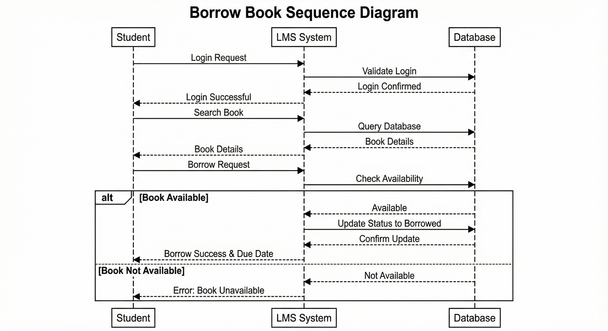
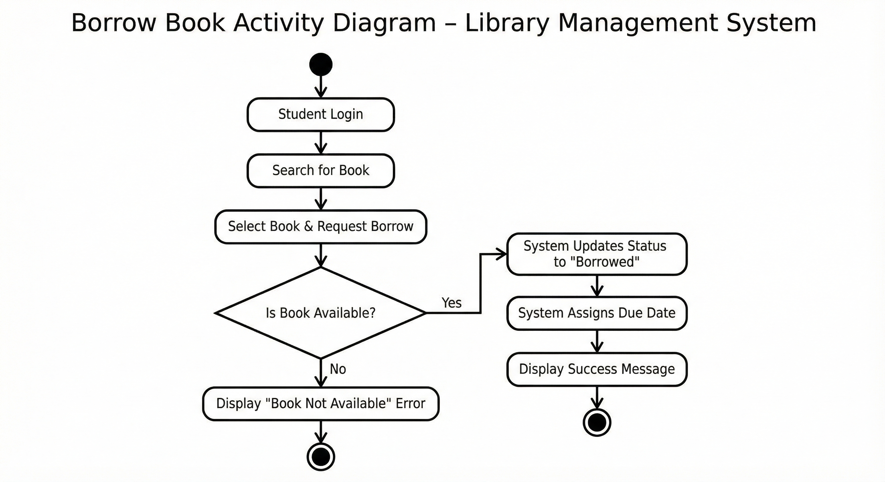
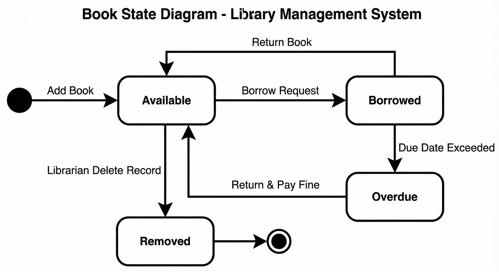

# 📘 Library Management System (LMS) - Analysis & Design

This repository contains the comprehensive **Software Engineering Documentation** for a Library Management System. It is a collaborative project that covers the complete "Analysis and Design" phase of the SDLC, demonstrating a Plan-Driven approach to building scalable software.

## 👥 Team & Contributions
This project is a result of a collaborative effort, dividing the system modeling into **Static** and **Dynamic** views:

| Team Member | Role & Contributions |
| :--- | :--- |
| **Abdallah Salah Elsheikh** | **Dynamic View Analysis:** Designed the behavioral diagrams (`Activity`, `Sequence`, `State`) to model the system's workflow and logic. |
| **Emad-Eldeen Essam** | **Static View Analysis:** Designed the structural diagrams (`Class`, `Object`, `Use Case`) to model the system's architecture and actors. |

## 🏗️ Project Overview
The project focuses on the architectural planning of a system designed to manage library resources, student transactions, and administrative reporting. It bridges the gap between client requirements and technical implementation.

## 📂 Documentation & UML Diagrams
The repository includes a full **Software Requirements Specification (SRS)** and a complete suite of UML diagrams.

### 1. System Structure (Static View)
*Designed by: Emad-Eldeen Essam*
* **Class Diagram:** Defines the object-oriented structure and relationships (Inheritance, Composition).
* **Object Diagram:** A runtime snapshot showing instances like `Student: Emad` and `Book: Java Programming`.
* **Use Case Diagram:** Illustrates actor interactions (Student, Admin, Librarian) with core functions.

### 2. System Behavior (Dynamic View)
*Designed by: Abdallah Salah Elsheikh*
* **Activity Diagram:** Visualizes the logic flow and decision points (e.g., *Is Book Available?*) during a transaction.
* **Sequence Diagram:** Details the time-ordered message flow for the "Borrow Book" process, from Login to Database update.
* **State Diagram:** Tracks the lifecycle of a book entity: `Available` ➝ `Borrowed` ➝ `Overdue` ➝ `Removed`.

## 📸 Diagrams Preview
Here are key excerpts from our design phase:

| **Sequence Diagram (Borrow Flow)** | **Class Diagram (Architecture)** |
|:----------------------------------:|:--------------------------------:|
|  |  |

| **Activity Diagram (Logic)** | **State Diagram (Lifecycle)** |
|:----------------------------:|:-----------------------------:|
|  |  |

> *Note: For the full set of diagrams, please refer to the files in the repository.*

## 📑 Key Features (SRS Highlights)
Based on the detailed [SRS For LMS.pdf](SRS%20For%20LMS.pdf):
* **Functional Requirements:** Real-time availability updates, Automated overdue notifications, and Book search.
* **Non-Functional Requirements:** 95% of requests respond within 2 seconds, Role-based access control.

## 🛠️ Tools & Standards
* **Modeling Language:** UML (Unified Modeling Language).
* **Documentation:** IEEE-830 Standard for SRS.
* **Methodology:** Object-Oriented Analysis and Design (OOAD).

---
**© 2025 Library Management System Project**
